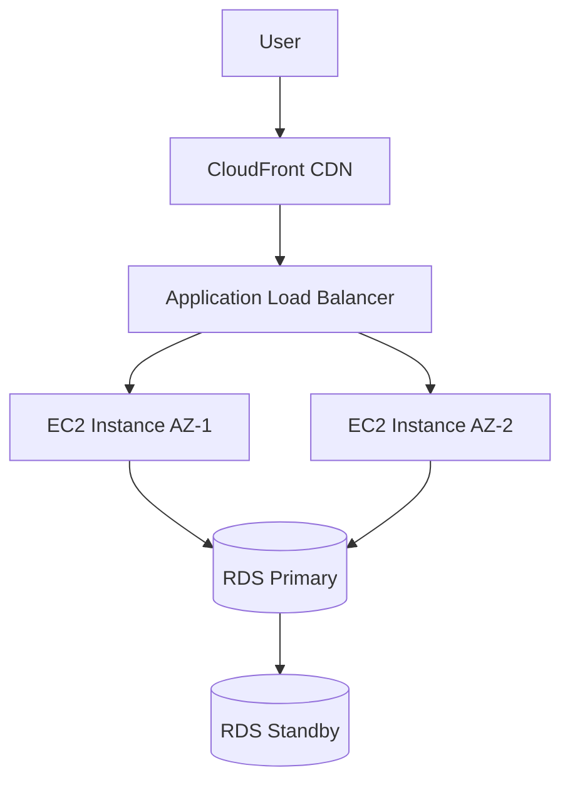
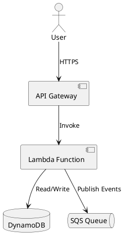

# Structured Output Formats

This document describes the structured output formats supported by the Architecture Design evaluation tasks. Diagram creation tasks may require outputs in standardized formats (Mermaid, PlantUML, or JSON) that can be automatically validated.

## Overview

When a dataset item includes an `output_format` field, the model's response must include a valid structured diagram in that format. The validator will:

1. **Extract** the code block from the response
2. **Validate** syntax and structure
3. **Check** for required components (if specified)
4. **Apply score modifiers** based on validation results

### Score Modifiers

| Validation Result | Impact |
|-------------------|--------|
| Valid output | +5% quality bonus |
| Invalid when required | -20% penalty to all dimensions |
| Missing required components | Noted in metadata (no score impact yet) |

## Mermaid Format

[Mermaid](https://mermaid.js.org/) is a JavaScript-based diagramming tool that uses text definitions to create diagrams.

### Requirements

- Use ` ```mermaid ` code blocks
- Start with diagram type declaration (`flowchart`, `graph`, `sequenceDiagram`, etc.)
- Define at least 2 nodes
- Include at least 1 edge/connection between nodes
- Use balanced brackets for node labels

### Valid Example



### Supported Diagram Types

| Type | Declaration | Use Case |
|------|-------------|----------|
| Flowchart | `flowchart TD` or `flowchart LR` | Architecture diagrams |
| Graph | `graph TD` or `graph LR` | Simple node connections |
| Sequence | `sequenceDiagram` | Request/response flows |

### Common Errors

| Error | Example | Fix |
|-------|---------|-----|
| Missing diagram type | Starting with `A --> B` directly | Add `flowchart TD` at the start |
| Unbalanced brackets | `A[Start --> B[End]` | Close brackets: `A[Start] --> B[End]` |
| No connections | Only defining nodes without `-->` | Add edges between nodes |
| Single node | `A[Only One] A --> A` | Add at least 2 distinct nodes |

### Invalid Example

```mermaid
    A[Start --> B[End]
    C[Disconnected]
```

**Issues:**
- Missing diagram type declaration
- Unbalanced bracket in node A
- Node C has no connections

## PlantUML Format

[PlantUML](https://plantuml.com/) is a component that allows writing UML diagrams using a simple text description.

### Requirements

- Use ` ```plantuml ` code blocks (optional if content has @startuml)
- Start with `@startuml`
- End with `@enduml`
- Define at least 1 component using `[Component Name]` or `component "Name"`
- Include at least 1 relationship using `-->`

### Valid Example



### Component Syntax Options

| Syntax | Example |
|--------|---------|
| Bracket notation | `[Web Server]` |
| Named component | `component "Database" as DB` |
| Actor | `actor User` |
| Database | `database "RDS" as RDS` |
| Queue | `queue "SQS" as SQS` |

### Common Errors

| Error | Example | Fix |
|-------|---------|-----|
| Missing @startuml | Starting with component definitions | Add `@startuml` at the beginning |
| Missing @enduml | No closing tag | Add `@enduml` at the end |
| No components | Only comments between tags | Add at least one `[Component]` |
| No relationships | Components without arrows | Connect with `-->` |

### Invalid Example

```plantuml
[Component A]
[Component B]
@enduml
```

**Issues:**
- Missing `@startuml` at the beginning
- No relationships between components

## JSON Format

The JSON architecture format provides a machine-readable representation of architectures.

### Requirements

- Use ` ```json ` code blocks
- Root object must have `architecture` key
- `architecture.components` array with at least 2 items
- Each component must have an `id` field
- Recommended: Include `relationships` array

### JSON Schema

```json
{
  "architecture": {
    "name": "string (optional)",
    "description": "string (optional)",
    "components": [
      {
        "id": "string (required)",
        "type": "string (optional: compute, storage, database, network, etc.)",
        "aws_service": "string (optional: EC2, S3, RDS, etc.)",
        "description": "string (optional)"
      }
    ],
    "relationships": [
      {
        "from": "string (component id)",
        "to": "string (component id)",
        "type": "string (optional: routes_to, queries, stores, etc.)"
      }
    ]
  }
}
```

### Valid Example

```json
{
  "architecture": {
    "name": "Three-Tier Web Application",
    "description": "Highly available web application with caching",
    "components": [
      {"id": "alb", "type": "load_balancer", "aws_service": "ALB"},
      {"id": "ec2_asg", "type": "compute", "aws_service": "EC2 Auto Scaling"},
      {"id": "elasticache", "type": "cache", "aws_service": "ElastiCache"},
      {"id": "rds", "type": "database", "aws_service": "RDS MySQL"}
    ],
    "relationships": [
      {"from": "alb", "to": "ec2_asg", "type": "routes_to"},
      {"from": "ec2_asg", "to": "elasticache", "type": "queries"},
      {"from": "ec2_asg", "to": "rds", "type": "queries"}
    ]
  }
}
```

### Common Errors

| Error | Example | Fix |
|-------|---------|-----|
| Missing architecture key | `{"components": [...]}` | Wrap in `{"architecture": {...}}` |
| Missing components | `{"architecture": {"name": "Test"}}` | Add `"components": [...]` array |
| Component without id | `{"type": "compute"}` | Add `"id": "unique_id"` |
| Too few components | Only 1 component | Add at least 2 components |
| Invalid JSON syntax | Missing quotes, trailing commas | Use valid JSON |

### Invalid Example

```json
{
  "architecture": {
    "components": [
      {type: "compute"}  // Missing quotes, missing id
    ]
  }
}
```

**Issues:**
- Missing quotes around `type` key
- Component missing required `id` field
- Only 1 component (minimum is 2)

## Format Selection Guidelines

| Scenario | Recommended Format |
|----------|-------------------|
| Visual architecture diagrams | Mermaid |
| UML-style component diagrams | PlantUML |
| Machine-parseable output | JSON |
| Simple request/response flows | Mermaid sequenceDiagram |
| Complex multi-service architectures | PlantUML or JSON |

## Using Expected Components

Dataset items can specify `expected_components` to validate that key AWS services are mentioned:

```json
{
  "output_format": "mermaid",
  "expected_components": ["ALB", "EC2", "RDS", "CloudFront"]
}
```

The validator checks (case-insensitive) that these component names appear in the extracted diagram content. Missing components are reported in the validation metadata but do not currently affect scoring.

## Integration with LLM Judge Scoring

When `output_format` is specified:

1. **Pre-validation**: Structural validation runs before LLM judging
2. **Score modification**: Valid outputs get quality bonus; invalid get penalty
3. **Metadata capture**: Validation results included in score output

The LLM judge still evaluates:
- **Accuracy**: Correctness of AWS service selection
- **Completeness**: Coverage of requirements
- **Quality**: Best practices and clarity

Structural validation is additive - it ensures the output is usable while the LLM judge assesses architectural merit.

## Validation Bypass

For tasks where structured output is helpful but not required, omit the `output_format` field. The scorer will skip validation and use standard LLM judging.

## See Also

- [Architecture Scoring](ARCHITECTURE_SCORING.md) - LLM judge rubrics
- [Scoring](SCORING.md) - Overall scoring methodology
