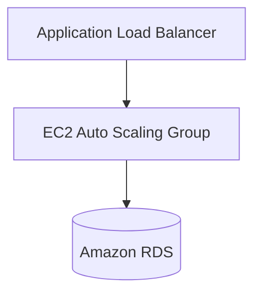

# Task: Create Documentation and Examples

**Epic:** [structured-diagram-formats-and-validation.md](../epics/structured-diagram-formats-and-validation.md)
**Size:** `S`
**Status:** `Done`

## Context

To help users understand the structured output requirements and to serve as reference for adding new dataset items, we need documentation with examples of valid outputs in each format.

## Acceptance Criteria

- [ ] Create `docs/STRUCTURED_OUTPUTS.md` documenting format requirements
- [ ] Include valid/invalid examples for each format (Mermaid, PlantUML, JSON)
- [ ] Document validation rules and common errors
- [ ] Link from SCORING.md and ARCHITECTURE_SCORING.md
- [ ] Add sample outputs that would score well

## Technical Notes

**Relevant Files:**
- `docs/STRUCTURED_OUTPUTS.md` — New documentation file
- `docs/SCORING.md` — Add link
- `docs/ARCHITECTURE_SCORING.md` — Add link

**Document Structure:**
```markdown
# Structured Output Formats

## Overview
Diagram creation tasks may require structured output formats...

## Mermaid Format
### Requirements
- Use ```mermaid code blocks
- Start with diagram type (flowchart, graph, etc.)
- Define nodes and edges using standard syntax

### Valid Example


### Common Errors
- Missing diagram type declaration
- Unbalanced brackets
- Invalid edge syntax

## PlantUML Format
...

## JSON Format
...

## Validation Scoring
- Valid output: +5% quality bonus
- Invalid when required: -20% overall penalty
```

**Gotchas:**
- Examples should be realistic AWS architectures
- Show both minimal valid and comprehensive examples
- Include edge cases that commonly trip up models

## Dependencies

- **Blocked by:** 001, 002 (need to know validation rules)
- **Blocks:** None

## Verification

```bash
# Verify documentation file exists
test -f docs/STRUCTURED_OUTPUTS.md && echo "Docs created"

# Check links from other docs
grep -l "STRUCTURED_OUTPUTS" docs/*.md
```
